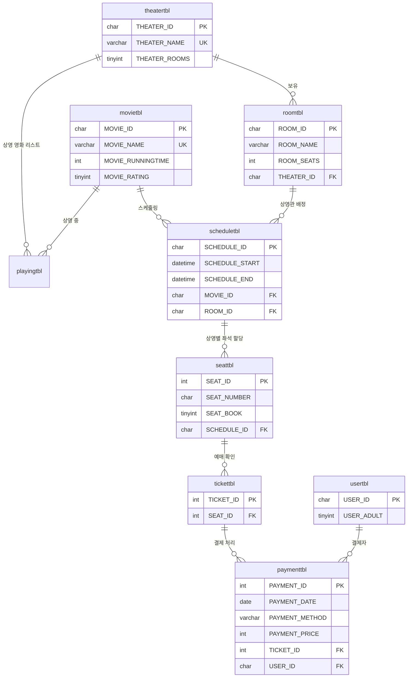

# Cinema-Management-System
영화관의 영화 등록과 상영 일정 게시서부터 영화의 예매와 취소 혹은 환불 과정까지를 다루는 프로젝트입니다.  
DB 설계를 MySQL로 구현하고, C#과 WinForms를 통해 데이터를 시각화하고 관리합니다.  

## RDBMS 기반 영화 예매 관리 시스템
- **목적:** 데이터 간의 무결성을 유지하며, 영화 상영 일정 및 좌석 예약 프로세스를 자동화하는 백엔드 로직 설계
- **핵심 기능:** 데이터 적재 자동화 알고리즘, 다중 조인을 활용한 정보 추출과 자원 검증, 동적 좌석 생성

## 데이터베이스 설계

## 핵심 기술

### 1. 데이터 무결성 보장을 위한 제약 조건
데이터베이스 레벨에서 데이터 오류를 방지하기 위해 엄격한 제약 조건을 설정하였습니다.
* **도메인 무결성:** `movietbl`의 `MOVIE_RATING` 컬럼에 `CHECK` 제약 조건을 설정하여 정해진 연령 등급(0, 12, 15, 18) 외의 값이 입력되지 않도록 통제했습니다.
* **결제 수단 제한:** `paymenttbl`의 `PAYMENT_METHOD` 항목을 '카드', '쿠폰', '현금', '모바일', '포인트'로 한정하여 데이터 일관성을 확보했습니다.
* **참조 무결성:** 모든 테이블 간 관계에 외래키(Foreign Key)를 설정하고, 부모 레코드 수정 시 자식 레코드에 자동으로 반영되는 `ON UPDATE CASCADE` 옵션을 전략적으로 활용했습니다.

### 2. 효율적인 상영 및 예약 구조
중복 데이터를 최소화하고 조회 성능을 고려하여 체계적인 정규화 설계를 적용했습니다.
* **스케줄링 고도화:** 영화 정보(`movietbl`)와 상영관 정보(`roomtbl`)를 `scheduletbl`에서 결합하여, 상영 시간과 장소에 대한 데이터 무결성을 높였습니다.
* **독립적 좌석 관리:** 동일한 좌석 번호라도 상영 회차에 따라 예약 상태가 달라야 하므로, `seattbl`이 `SCHEDULE_ID`를 참조하게 하여 상영 건별로 독립적인 예약 상태를 관리하도록 설계했습니다.

### 3. 예매 및 결제 시스템
사용자의 예매 프로세스가 안전하게 완료될 수 있도록 테이블 간 유기적인 연결 구조를 구축했습니다.
* **티켓-결제 연계:** `tickettbl`과 `paymenttbl`을 분리 설계하여, 티켓 발행 정보와 실제 결제 내역(환불 여부 포함)을 체계적으로 추적할 수 있습니다.
* **확장성 확보:** `usertbl`에 성인 여부(`USER_ADULT`) 데이터를 포함하여, 향후 등급별 예매 차단 로직 등 비즈니스 로직 확장성을 고려했습니다.

## 데이터 복구 가이드

본 프로젝트의 데이터베이스 구조와 샘플 데이터를 로컬 환경에 복구하는 방법입니다.

1. **MySQL Workbench 실행**: MySQL Workbench를 실행하고 로컬 서버(Local Instance)에 접속합니다.
2. **Data Import 메뉴 접속**: 상단 메뉴 바에서 `Server` -> `Data Import`를 차례대로 선택합니다.
3. **SQL 파일 로드**:
   - `Import from Self-Contained File` 옵션을 선택합니다.
   - 우측의 `[...]` 버튼을 클릭하여 리포지토리에 포함된 `CinemaManagementSystemDB.sql` 파일을 선택합니다.
4. **스키마(Schema) 생성**:
   - `Default Target Schema` 항목에서 `New...` 버튼을 클릭합니다.
   - 스키마 이름을 `cinemadb`로 입력하고 확인을 누릅니다.
5. **복구 실행**:
   - 하단의 `Import Progress` 탭에서 `Start Import` 버튼을 클릭합니다.
   - "Import Completed" 메시지가 표시되면 모든 테이블과 제약 조건이 정상적으로 복구된 것입니다.
